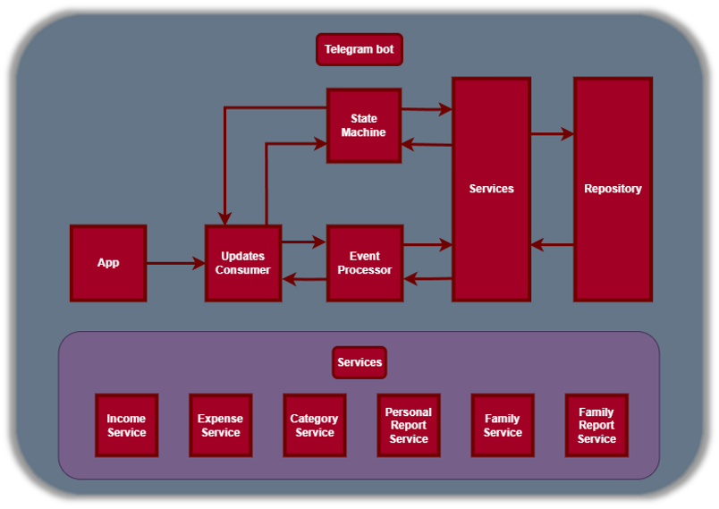
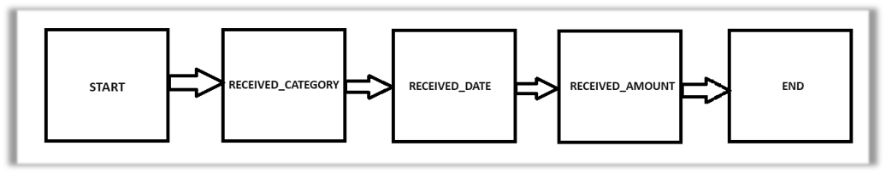
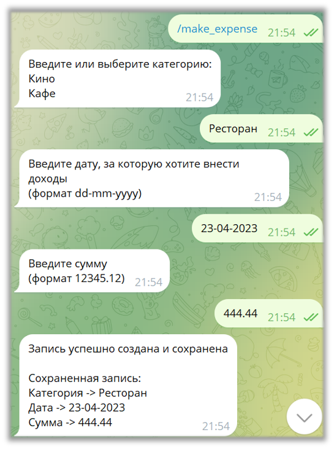
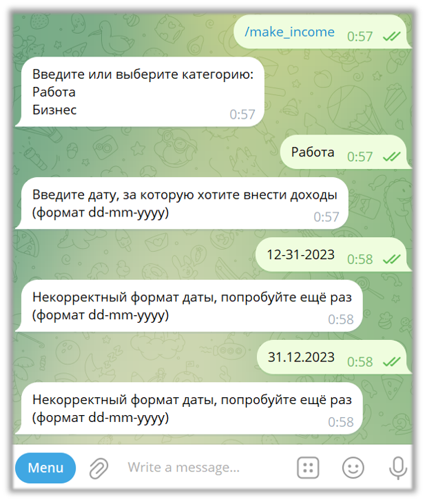
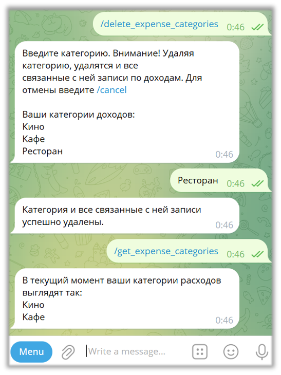

# FINANCIAL_GIGA_BOT

rep: https://github.com/Yadrick/financial_bot
project: https://github.com/users/Yadrick/projects/2

## О Телеграм-боте

Этот Телеграм-бот создан для учета финансовых транзакций (доходы/расходы)

Бот создавался в команде из 3-х человек.
Работа в команде происходила по методике Kanban, проводились ревью кода.

Общение с Телеграм API реализовано напрямую без сторонних библиотек.
Разработана машина состояний клиента. Применялись SOLID принципы.

### Возможности:
- Учет доходов и расходов
- Просмотр категорий доходов/расходов
- Удаление категорий доходов/расходов
- Отображение данных за текущий день
- Отображение данных за текущий месяц

### Компонентное взаимодействие / Архитектура

### Машина состояний сервиса записи доходов или расходов

### Примеры работы бота

Пример записи расхода:

Пример некорректного ввода:

Пример удаления записи:

